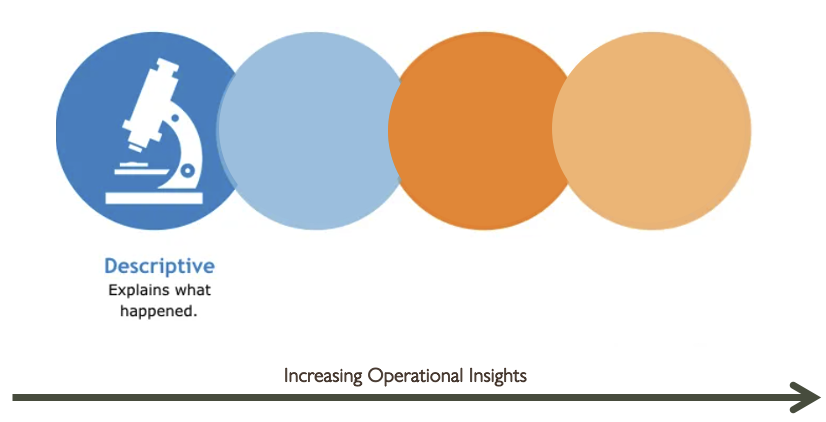
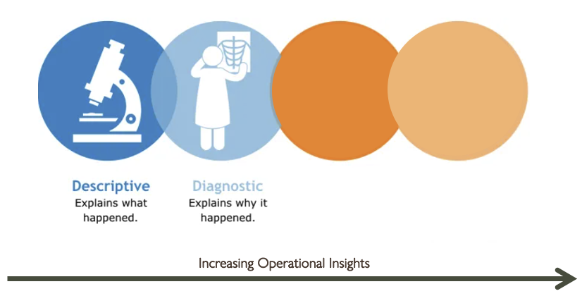

## INTRODUCTION TO DATA ANALYSIS

### Notes:
#### Point
Explain the LOs for the session

#### Narrative
- **Explain** core concepts of data, including the 5 Vs
- **Explain** the Data Analysis Cycle - Data Engineering, Data Analysis, and Data Science

#### Transition
Let's dive in!

---

## AGENDA
#### The 5 Vs
#### The Data Analytics Cycle
#### The 4 Analytic Capabilities
#### Summary

### Notes:
#### Point
To go through the session order

#### Transition
But first let's travel back in time!

---

## BACK IN 2004

### Notes:
#### Narrative
- Picture it. You wake up in 2004 to the sound of your radio, where Outkast’s “Hey Ya” (play a clip) is still dominating the radio waves nearly a year after being released.
- A bus drives by your window advertising that Shrek 2 is out in the theatres, but you decide that you’ll rent a movie from Blockbuster on your way home after work.
- Your phone rings and you flip open your state of the art Motorola RAZR V3 to see your friend is calling you. They want you to take their photo for their MySpace page…They’re flirting with someone on there but insist that this is different from online dating “like a loser”.
- The request for a photo reminds you of the iPod Photo with the colour screen that you saw in the shopping centre the other day. As you toss your keys into your bag on the way out the door, you wonder if you should try online shopping for the first time.  What’s the worst that could happen?

#### Transition
Things have changed a lot in 20 years!

---

## BACK IN 2004

### Notes:
#### Narrative
- Yes, just over two decades ago, life was very different. Technology was very different.
- We now generate an enormous amount of data daily, often unwittingly while using our smart phones and smart home devices, choosing streaming movies and tv to watch, browsing online stores, liking each others’ social media posts, or sending each other emails.
- It turns out that all of this data reveals information about who we are, what we like, what we are likely to do in the future. One infamous example of this was when, back in 2012, Target determined that a teenager was pregnant before her family even knew and started sending her coupons for baby items.

#### Transition
Let's look at the 5Vs

---

## THE 5 Vs
#### VOLUME

### Notes:

#### Narrative
- **Explain** that volume is that huge quantity of data that we generate daily, from online and offline activities in a magnitude of kilobytes and terabytes. This data is saved in records, tables and in files.

#### Transition
Hit down

|||

## THE 5 Vs
#### VOLUME
#### VELOCITY

### Notes:

#### Narrative
- **Explain** that velocity is the speed at which we are generating and processing data, sometimes in near real time. 
- **Explain** that we used to talk about Moore’s law which was a theory that processing power (the number of transistors on a microchip) doubles every two years.  This has slowed down now that we seem to have reached the physical limitations of silicon-based CPUs, but Moore’s law held for decades and perhaps one day very soon, quantum computing will become more commercially feasible. Meanwhile, the need for computational power is being met by building more datacentres.

#### Transition
Hit down

|||

## THE 5 Vs
#### VOLUME
#### VELOCITY
#### VARIETY

### Notes:

#### Narrative
- **Explain** that there is also a huge variety of data being generated today. This data comes in various forms such as structured data, unstructured data (like text and images), and semi-structured data (like JSON and XML).

#### Transition
Hit down

|||

## THE 5 Vs
#### VOLUME
#### VELOCITY
#### VARIETY
#### VERACITY

### Notes:

#### Narrative
- **Explain** that veracity refers to the quality and accuracy of the data. High-quality data is essential for making reliable analyses and decisions. Data with a lot of noise or errors can lead to incorrect conclusions.

#### Transition
Hit down

|||

## THE 5 Vs
#### VOLUME
#### VELOCITY
#### VARIETY
#### VERACITY
#### VALUE

### Notes:

#### Narrative
- **Explain** that value refers to the usefulness and importance of the data. Data itself is not valuable unless it can be turned into actionable insights that benefit the organization.

#### Transition
Next, let's explore what we do with all this data.

---

## EXPLORATORY DATA ANALYSIS (EDA)

### Notes:

#### Narrative
- **Explain** that Exploratory Data Analysis (EDA) involves summarizing the main characteristics of the data, often using visual methods.
- EDA helps in understanding the data, identifying patterns, spotting anomalies, and testing hypotheses.
- Common EDA techniques include:
  - Descriptive statistics: Mean, median, mode, standard deviation, etc.
  - Data visualization: Histograms, box plots, scatter plots, etc.
  - Correlation analysis: Understanding relationships between variables.

#### Transition
With a good understanding of EDA, we can move forward to more advanced analyses.

---

## DATA ANALYSIS LIFE CYCLE

### Notes:

#### Point
To look at who is responsible for which phases in the **Data Analysis Life Cycle**

#### Narrative
- **Explain** the diagram - generally it starts with **ingestion**
- **Data Engineers** are responsible for the data ingestion or ETL/ELT.  They set up the infrastructure to take the data from multiple data sources and feed it into one place, usually a data warehouse or data lake, where data analysts and data engineers can use it.  They might be responsible for some Data Lifecycle Management as well.
- **Data Analysts** are responsible for the data preparation phase of this data lifecycle, meaning they need to clean and transform the data before they can do any data exploration/analysis and then data visualisation and reporting.
- **Data Scientists** definitely also need to do data preparation before they can do what they specialise in which is making machine learning models, using patterns in the data to make predictions about the future outcomes and to prescribe a plan of action towards achieving key business goals.

#### Transition
Let's look at the Analytical Capabilities within this...

---

## THE 4 ANALYTICAL CAPABILITIES

### Notes:

#### Narrative
- **Explain** that there are 4 levels of analysis, each level will provide more operational insights as we move to the right on this graphic.

#### Transition
Move down to go through each level of analysis on the graphic.

|||

## THE 4 ANALYTICAL CAPABILITIES

### Notes:

#### Narrative
- **Explain** that with **descriptive analysis**, we look at historical data.
- For example a retailer might investigate sales data from the past year to see what their most popular products are, what the sales trends are for each season, or when the peak shopping periods are. E.g. They might find out that in January sales increased considerably.
- An alternative scenario might be a banks might identifying withdrawal amounts and times to better identify fraud. 

|||

## THE 4 ANALYTICAL CAPABILITIES

### Notes:

#### Narrative
- **Explain** that with **diagnostic analytics**, we look deeper to find the root causes for particular events.  
- For example, in the earlier sales example, we might investigate why their sales peaked in January - this might require looking at the marketing data as well as the sales data and noticing that this peak coincided with a marketing campaign where products were discounted.  

|||

## THE 4 ANALYTICAL CAPABILITIES

### Notes:

#### Narrative
- **Explain** that while data analysts carry out descriptive and diagnostic analytics, **predictive** (and prescriptive) analytics are the domain of data scientists. They build machine learning models which look for patterns in existing data to make predictions about future outcomes.  
- Based on historical data, predictive analytics could forecast when sales are likely to peak again. The prediction might be made using a machine learning model that takes into account patterns from previous years, current market trends, and other relevant factors. The model might predict, for example, a 20% increase in sales next January in comparison to the average monthly sales.

|||

## THE 4 ANALYTICAL CAPABILITIES

### Notes:

#### Narrative
- **Explain** that with **Prescriptive Analytics**, they not only make forecasts about what might happen but make recommendations about what prescribed actions should be taken based on those forecasts to maximise the probability of achieving the desired business objectives or mitigate risks. It involves using optimization and simulation algorithms to provide recommendations on how to handle future scenarios.
- **Guide** students through the following example:
  - Given the prediction that sales will peak next January, prescriptive analytics would provide actionable recommendations on how to maximize the benefits of this peak. For instance, it might suggest:
    - _Optimizing Inventory:_ Increase stock levels by 30% in December to meet the anticipated demand.
    - _Targeted Marketing:_ Launch a targeted marketing campaign in late December to capitalize on the predicted sales increase. This could include personalized discounts, promotions, and ads tailored to customer segments that are likely to respond well.
    - _Resource Allocation:_ Allocate additional staff and logistics resources during January to handle the expected increase in sales efficiently.
    - _Pricing Strategy:_ Consider offering a limited-time discount or bundle deals during the peak sales period to further boost sales.
  - By carrying out prescriptive analytics, the company would be able to not only prepare for the expected sales increase but also take proactive measures to enhance profitability and customer satisfaction during the peak period.

#### Transition
Let's look at applying what we've learnt

---

## ANALYTICS

### Notes:

#### Set-up
- **Task** students with labelling each example with the appropriate analytics
- **Give** students **10 minutes**
- **Distribute** the following examples to the students:

- Example 1: Healthcare
  - A hospital reviews patient admission records and finds that there was a significant increase in emergency room visits during the winter months.
- Example 2: Retail
  - A retail store notices a sudden drop in sales for a particular product line over the past three months. By analyzing customer feedback and social media mentions, the retailer discovers that the decrease in sales is due to negative reviews about the product's quality and a competitor's recent launch of a similar but superior product.
- Example 3: Manufacturing
  - A manufacturing company uses historical machinery performance data to predict when a specific machine is likely to fail, allowing for preventative maintenance scheduling.
- Example 4: Finance
  - A bank uses a risk assessment model to recommend actions for reducing exposure to bad loans by identifying high-risk loan applicants and suggesting alternative lending strategies.
- Example 5: Transportation
  - A logistics company examines past delivery data and identifies that the majority of late deliveries occurred during peak traffic hours.
- Example 6: Energy
  - An energy company uses weather forecasts and historical energy consumption data to predict future energy demand and recommends adjusting energy production levels to meet this predicted demand.

|||

## ANALYTICS - ANSWERS

### Notes:

#### Feedback
- Example 1: Healthcare
  - A hospital reviews patient admission records and finds that there was a significant increase in emergency room visits during the winter months.
  - Type of Analytics: **Descriptive**
- Example 2: Retail
  - A retail store notices a sudden drop in sales for a particular product line over the past three months. By analyzing customer feedback and social media mentions, the retailer discovers that the decrease in sales is due to negative reviews about the product's quality and a competitor's recent launch of a similar but superior product.
  - Type of Analytics: **Diagnostic**
- Example 3: Manufacturing
  - A manufacturing company uses historical machinery performance data to predict when a specific machine is likely to fail, allowing for preventative maintenance scheduling.
  - Type of Analytics: **Predictive**
- Example 4: Finance
  - A bank uses a risk assessment model to recommend actions for reducing exposure to bad loans by identifying high-risk loan applicants and suggesting alternative lending strategies.
  - Type of Analytics: **Prescriptive**
- Example 5: Transportation
  - A logistics company examines past delivery data and identifies that the majority of late deliveries occurred during peak traffic hours.
  - Type of Analytics: **Descriptive**
- Example 6: Energy
  - An energy company uses weather forecasts and historical energy consumption data to predict future energy demand and recommends adjusting energy production levels to meet this predicted demand.
  - Type of Analytics: **Predictive** and **Prescriptive** (as it involves both predicting future demand and recommending actions)
 
---

## SUMMARY

### Notes:

#### Narrative
1.**Ask** students why big data is big
- **Direct** students towards an answer which incorporates big data's:
  - Volume
  - Velocity
  - Variety
  - Veracity
  - Value

2.**Ask** students what the differences are between Data Engineering, Data Analysis, and Data Science
- **Direct** students towards an answer that summarises:
  - Engineers - infrastructure, obtaining and storing data
  - Analysts - preparation, cleaning, visualisations
  - Scientists - using patterns to make predictions about future outcomes

3.**Ask** what the four Analytical Capabilities are
- **Direct** students towards an answer that summarises:
  - Descriptive - explains what happened
  - Diagnostic - explains why it happened
  - Predictive - Forecasts what might happen
  - Prescriptive - Recommends an action based on the forecast
 
#### Transition
Let's start to look at all of this in more detail. But first let's take a break.

