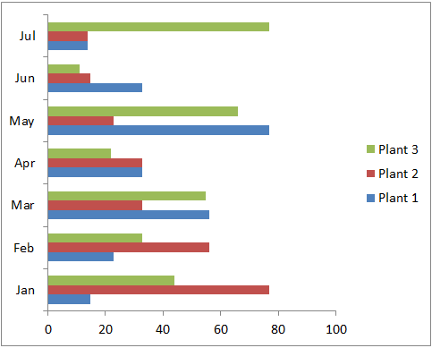
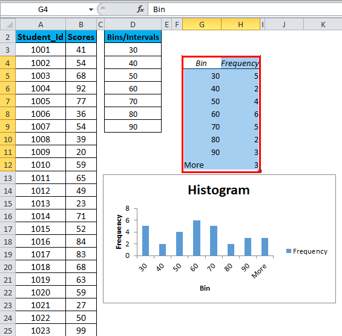
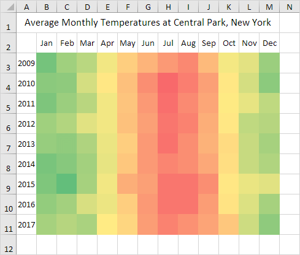

# Exploratory Data Analysis: Creating Effective Visualizations in Excel

---

## Agenda

1. Introduction to Data Visualization
2. Chart Types in Excel
3. Visualizing Continuous Numerical Data
4. Visualizing Distributions of Categorical Data
5. Best Practices for Creating Effective Visualizations
6. Q&A Session

---

## Introduction to Data Visualization

- **Purpose of Data Visualization**: To present data in a graphical format, making it easier to identify patterns, trends, and outliers.
- **Importance**: Helps in communicating data insights effectively to various stakeholders.

---

## Chart Types in Excel

---

### Common Chart Types

|||

1. **Column Chart**
   - Displays data using vertical bars.
   - Suitable for comparing data across categories.  

|||

1. **Bar Chart**
   - Displays data using horizontal bars.
   - Useful for comparing many categories.  

|||

3. **Line Chart**
   - Connects data points with a continuous line.
   - Ideal for showing trends over time.  

|||

4. **Pie Chart**
   - Represents data as slices of a pie.
   - Best for showing proportions of a whole. 

|||

5. **Scatter Plot**
   - Plots individual data points.
   - Useful for showing relationships between two numerical variables.  

|||

6. **Histogram**
   - Displays the distribution of a single numerical variable.
   - Useful for showing the frequency distribution of data.  

|||

7. **Area Chart**
   - Similar to a line chart, but the area below the line is filled.
   - Good for showing cumulative data trends over time.  

|||

8. **Box and Whisker Plot**
   - Shows the distribution of data based on a five-number summary.
   - Useful for identifying outliers and the spread of data.  

|||

9. **Heat Map**
   - Uses color to represent data values.
   - Ideal for showing the intensity of data values.  

---

## Visualizing Continuous Numerical Data

### Appropriate Charts

1. **Line Chart**
   - Ideal for visualizing trends in continuous data over time.

2. **Scatter Plot**
   - Best for showing relationships between two continuous variables.

3. **Histogram**
   - Effective for displaying the frequency distribution of continuous data.

4. **Box and Whisker Plot**
   - Useful for summarizing the distribution of continuous data.

|||

### Example

- Use a line chart to show the monthly sales trend over a year.
- Use a scatter plot to visualize the relationship between temperature and ice cream sales.

---

## Visualizing Distributions of Categorical Data

### Appropriate Charts

1. **Column Chart**
   - Suitable for comparing data across different categories.

2. **Bar Chart**
   - Useful for comparing a larger number of categories.

3. **Pie Chart**
   - Best for showing the proportion of each category as part of a whole.

4. **Heat Map**
   - Effective for showing the intensity of data across categories.

|||

### Example

- Use a column chart to compare the sales of different product categories.
- Use a pie chart to show the market share of different brands.

---

## Best Practices for Creating Effective Visualizations

|||

### Clarity and Simplicity

1. **Keep it Simple**
   - Keep focus on the data by keeping the design simple.
   - Use clear labels and legends.

2. **Focus on Key Insights**
   - Highlight the most important data points.
   - Use color and size to draw attention to key information.

3. **Use Appropriate Chart Types**
   - Choose the right chart type for the data being presented.
   - Ensure the chart accurately represents the data.

|||

### Design Principles

1. **Consistency**
   - Use consistent colors, fonts, and styles.
   - Maintain uniform scales and axes.

2. **Readability**
   - Ensure text and labels are readable.
   - Avoid using too many colors or complex designs.

3. **Accuracy**
   - Represent data accurately without distortion.
   - Ensure scales are correct and consistent.

|||

### Context and Interpretation

1. **Provide Context**
   - Include titles, labels, and legends to explain the chart.
   - Use annotations to highlight key points.

2. **Avoid Misleading Visuals**
   - Ensure the data is not misrepresented.
   - Avoid using 3D charts which can distort data interpretation.

3. **Test Your Visualizations**
   - Review your visualizations for accuracy and clarity.
   - Get feedback from others to ensure the message is clear.

---

## Summary

- **Chart Types**: Familiarize yourself with the most commonly used chart types available in Excel.
- **Appropriate Visualizations**: Use line charts, scatter plots, histograms, and box plots for continuous numerical data. Use column charts, bar charts, pie charts, and heat maps for categorical data.
- **Best Practices**: Keep visualizations simple, clear, consistent, readable, and accurate. Provide context and avoid misleading visuals.

---

### Q&A Session

---

### Hands-on demonstration of creating these visualizations in Excel.
