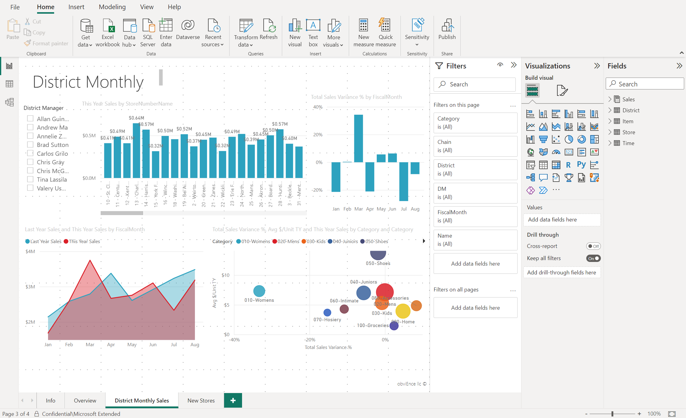
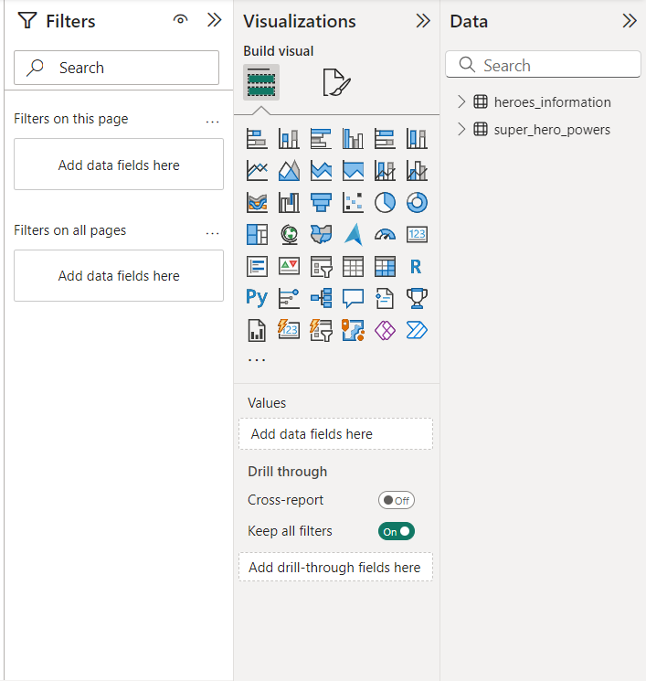
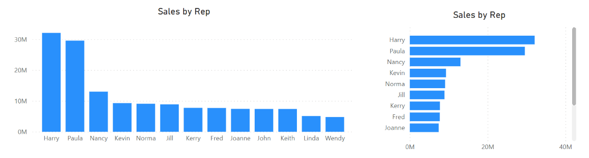
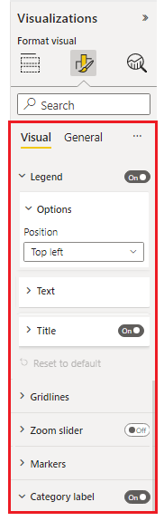
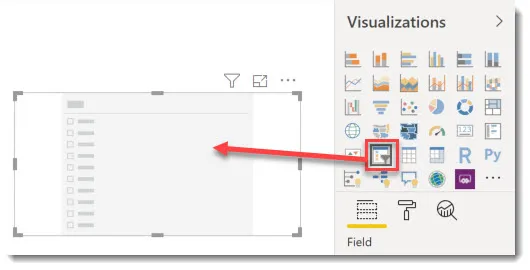
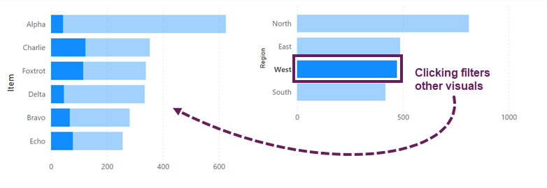
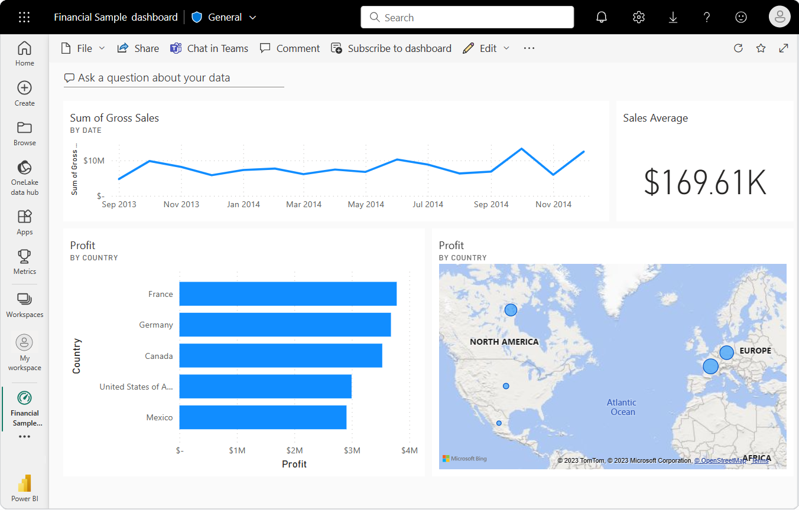
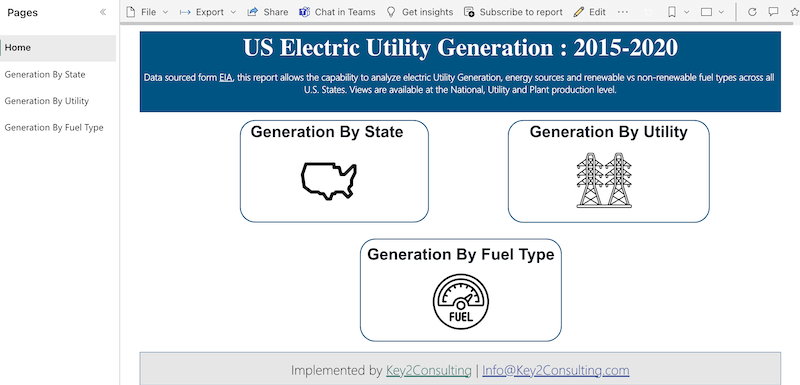
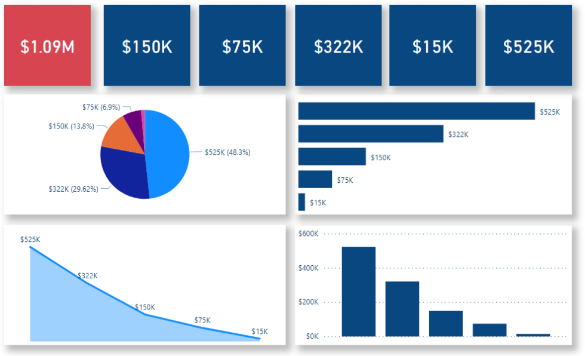

# Power BI Visualizations: Bringing Your Data to Life

---

## Welcome Back!

- In our morning session, we introduced you to Power BI and explored data cleaning, transforming, and modeling.
- This afternoon, we're focusing on creating **visualizations** to gain insights about your data and to communicate those insights to others and allow them to generate their own insights from interactive reports.

### Notes:
- A recap of the previous session and set expectations for the current session.

---

## The Report View: Your Visualization Workspace

### Notes:

Recall that the **Report View** is where you create and customize visualizations. It’s the central place for designing reports.

---

### Key Panes for Visualization

### Notes:
- **Data Pane** is for selecting fields and measures from your data model.
- **Visualizations Pane** is for choose and customizing visualisations.
- **Filters Pane** is for applying filters to focus on specific data points in your visualizations.
- You will often use all three of these panes when creating a visualisation.  They are available on the righthand side of the screen.

---

## Creating Your First Visualization

### Start with Data
- In the **Data Pane**, select the fields you want to visualize.
- Power BI automatically chooses a visualization type based on the data.

---

### Customizing the Visualization
- **Change the Visualization Type**: You can use the icons in the **Visualizations Pane** to switch between chart types.

### Notes:
- There is a lot of flexibility in switching between different visualization types depending on the data and analysis goal.

---

## Adding More Context with Axes and Legends
- Allows you to see how data changes over time.
- Legends help differentiate data categories visually.

### Notes:
- Adding time elements and legends can provide deeper insights by contextualizing the data.

---

## We will explore some of these visualizations in the upcoming demo

### Area Charts for Trend Analysis
- **Area Charts**: Great for comparing metrics over time.
- In Power BI, simply switch from a column chart to an area chart to better visualize cumulative trends.

||| 

### Map Visualizations for Geographic Data
- **Map Visuals**: Automatically generated when you select geographic fields like `Territory`.
- **Enhance** by adding metrics (e.g., `Total Stores`) to the Bubble size field and categories (e.g., `Store Chain`) to the Legend.

### Notes:
- Advanced visualizations help in uncovering insights that are not immediately obvious in simpler charts.

---

## Formatting Your Visuals

### Notes:
Use the **Format Visual** section of the visualisation pane to adjust colors, labels, titles, and more.
Formatting can greatly enhance the clarity and effectiveness of your visualizations.

---

## Bringing It All Together

### Interactivity and Filtering
- **Slicers**: Add slicers to your report to enable interactive filtering by fields like `Country`, `ProductName`, or `OrderDate`.

|||

- **Cross-Filtering**: Selecting data in one visual updates all other visuals on the report page.

--- 

### Saving and Sharing Your Work
- Don’t forget to save your report once you're happy with the visuals.
- Your reports can be shared or published to Power BI Service for share reports easily with others. They will only need the url and not need to have Power BI on their desktop to read your reports.

### Notes:
- The interactivity of the reports is not only dynamic and user-friendly but allows users to generate their own insights.

---

## Dashboards vs Reports

|||

### Reports

In Power BI, visualisations about a single topic go together on a single page (e.g. product specific visuals on the product page and revenue specific data visuals on the revenue page) and multiple pages can form a single report.  

|||

### Dashboards

When you put only the most essential visuals on a single page then it is called a dashboard in Power BI.

---

## Conclusion

- Today, we covered the essentials of creating and customizing visualizations in Power BI.
- These skills will allow you to create insightful and interactive reports.

---

## Questions?

- The floor is open for any questions before wrapping up the session.

---
