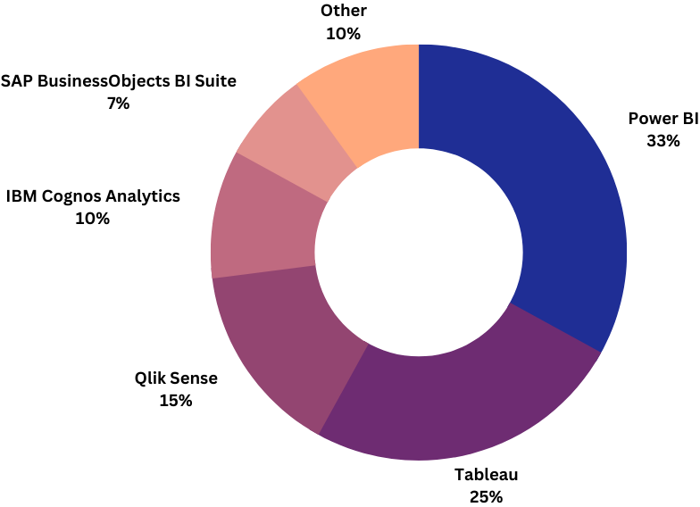
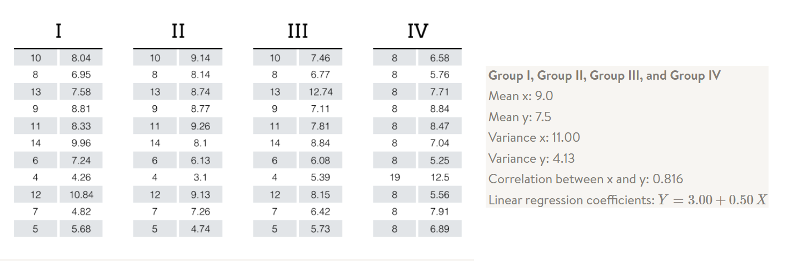
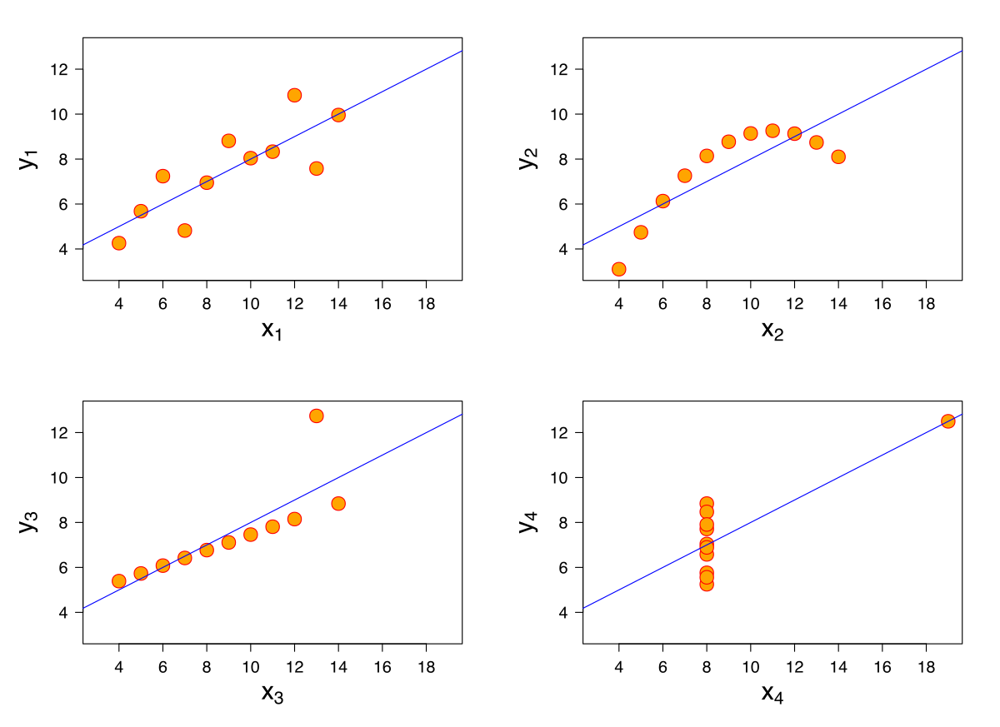
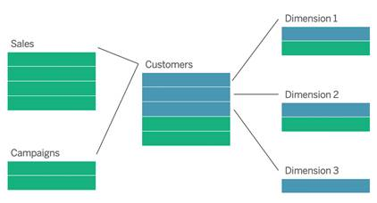

# Introduction to Tableau

---

## A Leading BI Tool

---

## **Visualizations Help to tell a Story

### Notes: 
- Visualizations help in understanding complex data by presenting it in a simple, intuitive format.
- They reveal patterns, trends, and insights that might be missed in raw data.
Anscombe's quartet is a group of datasets (x, y) that have the same mean, standard deviation, and regression line.  If we just look at the basic stats, these dataset might seem to be the same...

--

### Notes: ...but when we visualise these datasets, we see that they are in fact qualitatively different.
---

## **Dashboards allow users to generate their own Insights

### Notes: Dashboards allow users to interact dynamically with the data and generate their own Insights.

---

## Tableau understands relational databases

### Notes: Unlike Excel, Tableau understands that a customer in the orders table is the same as the customer in the customer information table.

---

## Let's Delve into Tableau

