# Introduction to Power BI

---

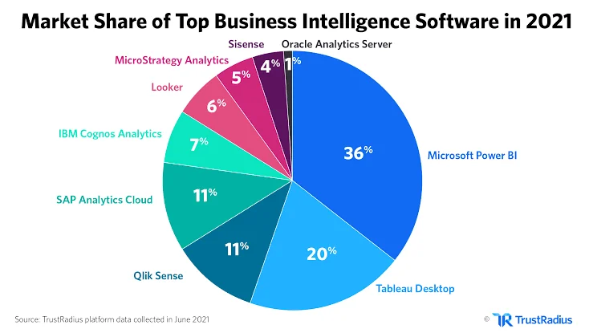
### Notes:
- **Power BI** is a leading Business Intelligence (BI) tool, from Microsoft, and is widely used in industries for its powerful analytics and seamless integration with other Microsoft tools.
- It enables users to connect to multiple data sources, clean and transform data, create data models, and produce insightful reports and dashboards.

---

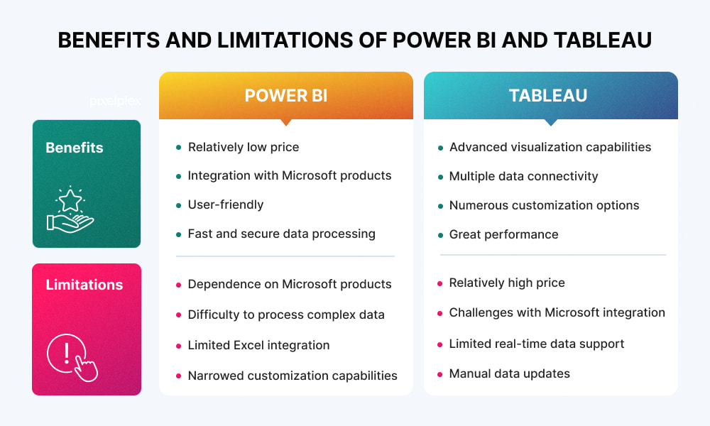
Image from https://pixelplex.io/blog/power-bi-vs-tableau/

### Notes:
- Both tools are powerful, but Power BI offers stronger integration with Microsoft products and a lower entry cost, making it ideal for organizations already within the Microsoft ecosystem.

---

## Power BI Desktop vs. Power BI Service

### Power BI Desktop
- **Desktop application** used for creating data models, reports, and visualizations.
- Offers **full functionality** for data transformation, modeling, and visualization.
- Reports created in Desktop can be published to Power BI Service.

### Power BI Service
- **Online platform** for sharing and distributing reports and dashboards.
- Facilitates collaboration and access to reports from anywhere.
- Provides additional features like **automatic data refresh** and **subscriptions**.

### Notes:

- Understanding the distinction between these two is crucial for efficiently managing and sharing reports.

---

## Navigating Power BI: The Key Views

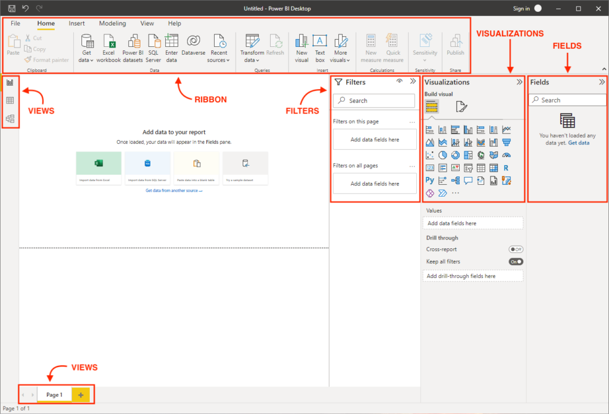

|||

### 1. Report View

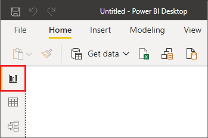
- The **default view** where you create and design your reports using visualizations.

|||

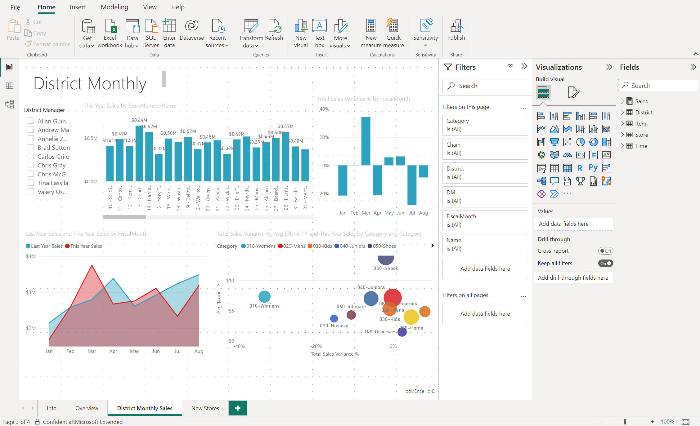

### Notes:

The report view has drag and drop fields to create interactive charts and graphs.

|||

### 2. Data View

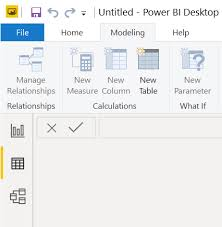
Allows you to **view and explore** the data tables you’ve imported.

|||

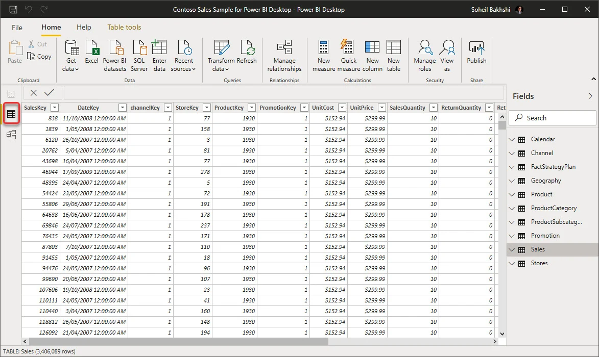

### Notes:

You can perform simple data editing tasks here.

|||

### 3. Model View

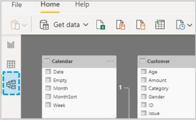

This view is where you can set up or check the **relationships** between different tables.

|||

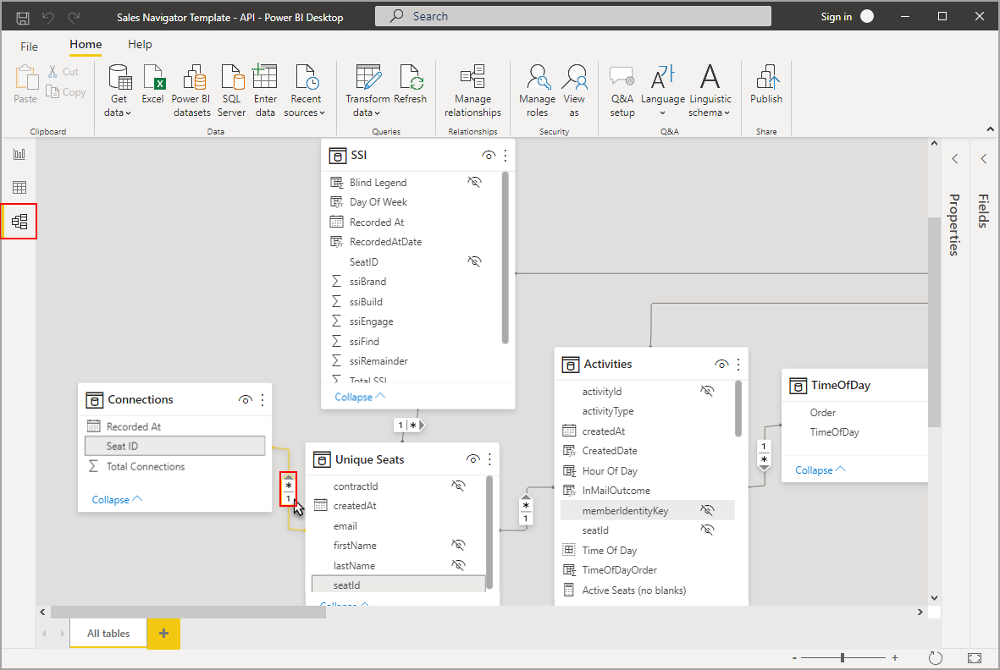

### Notes: 

Allows you to create, manage, and view relationships between your tables. 

|||

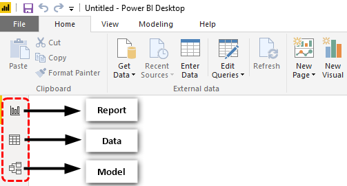

Each view serves a distinct purpose, and knowing when to use each one is important to working effectively in PowerBI.

---

## Connecting to Data Sources

- Power BI can connect to a wide variety of data sources, including:
  - **Excel files**
  - **Databases** (SQL Server, Oracle, etc.)
  - **Online services** (Azure, Salesforce, etc.)
  - **APIs and more**

- The first step in any Power BI project is **importing data** from these sources.

### Notes:
- The versatility in data connections is one of Power BI’s strongest features, allowing for robust and diverse data analysis.

---
 
## Cleaning and Transforming Data in Power BI

### Power Query in Power BI

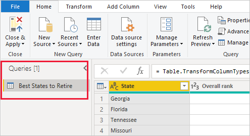

- **Power Query** is the tool used in Power BI for data cleaning and transformation.
- If you've used Power Query in Excel, this will feel very familiar, though it works slightly differently here.

---

### Common Data Transformation Tasks:
- **Removing columns** and rows that are not needed.
- **Replacing values** to correct errors.
- **Filling missing values** to ensure complete data.
- **Merging and appending** tables for consolidated analysis.

### Notes:
- Cleaning and transforming data is a crucial step before building a data model, as it ensures data integrity and accuracy.

---

## Data Modeling in Power BI

### What is Data Modeling?

- Data modeling involves creating relationships between different tables to enable more complex analysis.
- Power BI handles **one-to-one, one-to-many, and many-to-many relationships**.

### Notes:
- Unlike Excel, Power BI is designed to manage relational databases with ease, making it possible to analyze large and complex datasets.

---

### Understanding Relationships

- **One-to-One**: Each value in Table A is related to one, and only one, value in Table B.
  - Example: Each employee has one ID.
  
- **One-to-Many**: One value in Table A is related to many values in Table B.
  - Example: One department has many employees.
  
- **Many-to-Many**: Values in Table A can relate to multiple values in Table B and vice versa.
  - Example: Students enrolled in multiple courses.

### Notes:
- Relationships allow for accurate data aggregation and reporting across multiple tables.

---

## Wrapping Up: Power BI Essentials

- **Power BI** is a powerful tool for connecting, transforming, modeling, and visualizing data.
- Understanding the **difference between views**, how to **clean data**, and how to **build relationships** are foundational skills.
- **Power Query** plays a crucial role in preparing your data for analysis.
- The ability to handle complex **data models** sets Power BI apart from traditional tools like Excel.

### Notes:
- This foundational knowledge sets the stage for more advanced topics, like creating impactful visualizations, which will be covered in subsequent sessions.

---

## Questions?

Feel free to ask any questions or dive deeper into any of the topics we've covered.

---

