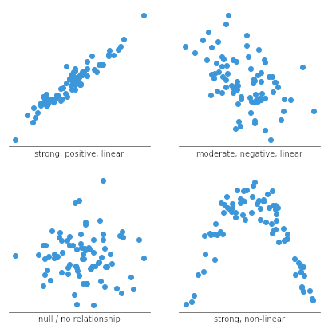
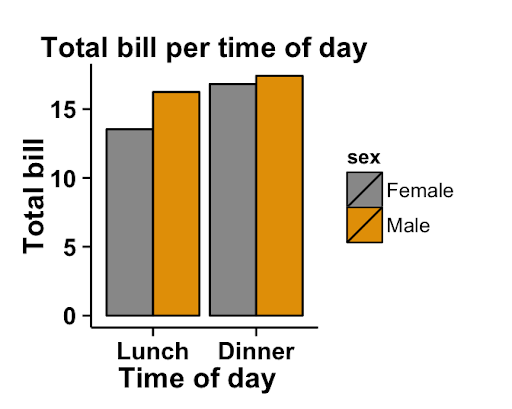
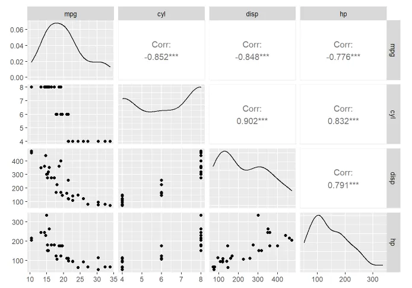
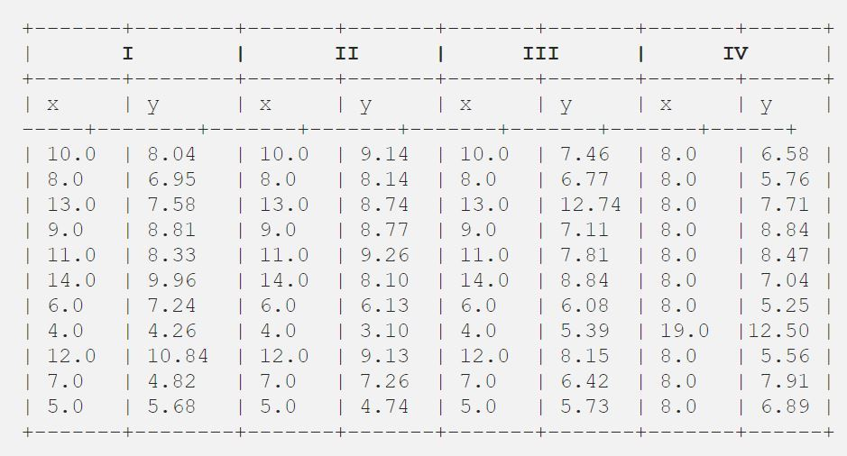
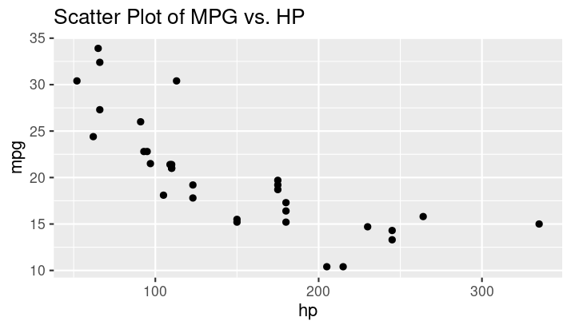
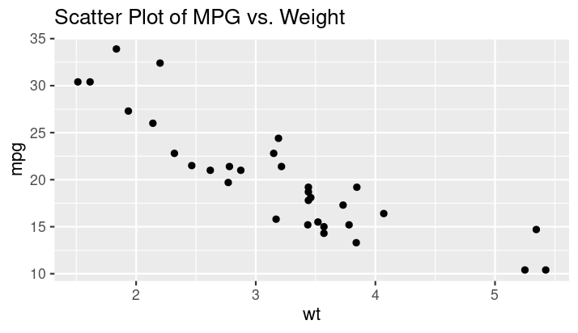

# Visualization in R

---

## Common Libraries for Visualizations in R

### ggplot2
- A powerful and flexible visualization package
- Based on the grammar of graphics
- Allows complex and multi-layered visualizations
- Example:
  ```r
  install.packages("tidyverse")
  library(tidyverse)
  ```
### Notes:
- Explain that `ggplot2` is the go-to package for creating detailed and complex visualizations.
- Mention that it follows the grammar of graphics, which makes it intuitive once learners get the hang of it.

---

### lattice
- For creating trellis graphs
- Useful for conditioning plots
- Example:
  ```r
  install.packages("lattice")
  library(lattice)
  ```
### Notes:
- Lattice is good for creating multi-panel plots, especially useful for comparing multiple subsets of data.
- Highlight that while it's less flexible than `ggplot2`, it's very powerful for specific types of visualizations.

---

### plotly
- For creating interactive visualizations
- Built on top of `ggplot2`
- Example:
  ```r
  install.packages("plotly")
  library(plotly)
  ```
### Notes:
- Mention that `plotly` can convert `ggplot2` plots into interactive web-based visualizations.
- Useful for dashboards and presentations where interactivity adds value.

---

### GGally
- Extension of `ggplot2`
- For creating pair plots and correlation plots
- Example:
  ```r
  install.packages("GGally")
  library(GGally)
  ```
### Notes:
- Explain that `GGally` simplifies the creation of complex visualizations like pair plots.
- It's especially useful for quickly exploring relationships between multiple variables.

---

# Types of Visualizations and Their Uses

---

## Scatter Plot
- **What it shows:** Relationship between two continuous variables
- **Useful for:** Identifying correlations, clusters, and outliers
- **Example:** 
  ```r
  ggplot(iris, aes(x = Sepal.Length, y = Sepal.Width)) + geom_point()
  ```


### Notes:
- Use scatter plots to show relationships between two numerical variables.
- Great for identifying trends, clusters, and outliers.
- Example with `iris` dataset helps relate to something familiar.

---

## Line Plot
- **What it shows:** Trends over time or ordered categories
- **Useful for:** Time series analysis, trend visualization
- **Example:**
  ```r
  ggplot(airquality, aes(x = Day, y = Ozone)) + geom_line()
  ```

### Notes:
- Line plots are excellent for visualizing data over time.
- Emphasize that they can show trends and patterns effectively.
- Useful in time series analysis.

---

## Bar Plot
- **What it shows:** Counts or frequencies of categories
- **Useful for:** Comparing different categories, distributions
- **Example:**
  ```r
  ggplot(mtcars, aes(x = factor(cyl))) + geom_bar()
  ```

### Notes:
- Bar plots are perfect for categorical data.
- Highlight that they are used to compare different groups.
- Mention that they can be horizontal or vertical.

---

## Histogram
- **What it shows:** Distribution of a continuous variable
- **Useful for:** Understanding the distribution, detecting skewness
- **Example:**
  ```r
  ggplot(iris, aes(x = Petal.Length)) + geom_histogram(binwidth = 0.5)
  ```

### Notes:
- Histograms are used to understand the distribution of a numerical variable.
- Explain the importance of binwidth and how it can affect the interpretation.
- Good for detecting skewness and kurtosis.

---

## Box Plot
- **What it shows:** Summary of a continuous variable's distribution
- **Useful for:** Identifying outliers, comparing distributions
- **Example:**
  ```r
  ggplot(iris, aes(x = Species, y = Sepal.Length)) + geom_boxplot()
  ```

### Notes:
- Box plots are excellent for summarizing distributions.
- They show medians, quartiles, and potential outliers.
- Useful for comparing distributions across different categories.

---

## Violin Plot
- **What it shows:** Summary of a continuous variable's distribution _and_ density

Violin charts can be produced with ggplot2 thanks to the geom_violin() function.

- **Example:**
  ```r
  ggplot(iris, aes(x = Species, y = Sepal.Length)) + geom_violin()
  ```


### Notes:
- Violin plots combine box plots and density plots.
- Useful for comparing distributions while showing the density.
- Highlight their effectiveness in showing multi-modal distributions.

---

## Density Plot
- **What it shows:** Smoothed distribution of a continuous variable
- **Useful for:** Comparing distributions, identifying modes
- **Example:**
  ```r
  ggplot(iris, aes(x = Petal.Length, fill = Species)) + geom_density(alpha = 0.5)
  ```

### Notes:
- Density plots are similar to histograms but smoothed.
- Highlight their usefulness in comparing multiple distributions.
- Explain how they can show multiple peaks (modes).

---

## Pair Plot
- **What it shows:** Pairwise relationships between multiple variables
- **Useful for:** Multivariate analysis, exploring correlations
- **Example:**
  ```r
  ggpairs(iris, aes(color = Species))
  ```

### Notes:
- Pair plots are powerful for exploring relationships in multivariate datasets.
- They show scatter plots for pairs of variables and histograms for single variables.
- Useful for quick correlation checks.

---

## Time Series Plot
- **What it shows:** Data points in a time sequence
- **Useful for:** Trend analysis, seasonal patterns
- **Example:**
  ```r
  ggplot(airquality, aes(x = as.Date(paste(1973, Month, Day, sep="-")), y = Ozone)) + geom_line()
  ```

### Notes:
- Time series plots are crucial for visualizing how data changes over time.
- Highlight their importance in identifying trends and seasonal patterns.
- Useful in finance, meteorology, and many other fields.

---

## Heatmap
- **What it shows:** Intensity of values in a matrix
- **Useful for:** Visualizing correlation matrices, clustering
- **Example:**
  ```r
  install.packages("reshape2")
  library(reshape2)
  cor_data <- cor(mtcars)
  ggplot(melt(cor_data), aes(Var1, Var2, fill = value)) + geom_tile()
  ```

### Notes:
- Heatmaps are excellent for visualizing matrix data.
- Commonly used for showing correlations and clustering results.
- Mention their use in genomics, market basket analysis, etc.

---

## Interactive Plot
- **What it shows:** Dynamic visualizations with tooltips
- **Useful for:** Exploratory data analysis, presentations
- **Example:**
  ```r
  ggplotly(ggplot(iris, aes(x = Sepal.Length, y = Sepal.Width)) + geom_point())
  ```
[Interactive Plot](https://r-graph-gallery.com/interactive-charts.html)
### Notes:
- Interactive plots add a layer of interactivity to static plots.
- Useful in dashboards and interactive reports.
- Mention how they enhance user engagement during presentations.

---

# Importance of Visualizations in Analysis

---

## Anscombe's Quartet - The Data



|||

### Table of Statistical Measures
| Dataset | Mean of X | Mean of Y | Variance of X | Variance of Y | Correlation (X, Y) |
|---------|-----------|-----------|---------------|---------------|--------------------|
| I       | 9         | 7.5       | 11            | 4.125         | 0.816              |
| II      | 9         | 7.5       | 11            | 4.125         | 0.816              |
| III     | 9         | 7.5       | 11            | 4.125         | 0.816              |
| IV      | 9         | 7.5       | 11            | 4.125         | 0.816              |

### Notes:
- Anscombe's Quartet consists of four datasets with identical summary statistics.
- Despite having the same means, variances, and correlations, the datasets are very different.

|||

## Anscombe's Quartet - The Visualizations


### Notes:
- Visualizing the datasets shows their true nature.
- Dataset I is a simple linear relationship.
- Dataset II is a curvilinear relationship.
- Dataset III has an outlier influencing the correlation.
- Dataset IV has a vertical pattern with one outlier.
- This demonstrates that summary statistics alone can be misleading.

---

## Example: Initial Analysis with mtcars

### Initial Analysis
- **Step:** Calculate and visualize summary statistics of `mpg` in the `mtcars` dataset.
- **Result:** Mean `mpg` seems consistent across the dataset.
- **Code:**
  ```r
  summary(mtcars$mpg)
  ```

### Notes:
- Start with basic summary statistics to understand the central tendency and spread of the data.
- Initial statistics provide a high-level overview but may hide important details.

---

## Adding Visualizations

### Scatter Plot of MPG vs. HP
- **Step:** Create a scatter plot of `mpg` vs. `hp`.
- **Observation:** A negative correlation appears between `mpg` and `hp`.
- **Code:**
  ```r
  ggplot(mtcars, aes(x = hp, y = mpg)) + geom_point() + ggtitle("Scatter Plot of MPG vs. HP")
  ```


### Notes:
- Visualization reveals a clear negative correlation between horsepower and fuel efficiency.
- This insight could be missed with summary statistics alone.
- Highlight the importance of visualizing relationships between variables.

---

## Changing the Analysis Direction

### Direction Change
- **Insight:** Realize the relationship between horsepower and fuel efficiency.
- **Next Step:** Investigate other factors influencing `mpg`, such as weight (`wt`).
- **Code:**
  ```r
  ggplot(mtcars, aes(x = wt, y = mpg)) + geom_point() + ggtitle("Scatter Plot of MPG vs. Weight")
  ```


### Notes:
- Based on the scatter plot, further investigate how weight affects `mpg`.
- Visualizations help in uncovering multi-faceted relationships.
- Emphasize that visualizations guide the exploration and analysis process.

---

## Conclusion
- **Visualization's Role:** Transformed a simple statistical analysis into a deeper investigation of multiple factors.
- **Takeaway:** Visualizations are crucial for exploring data, not just presenting findings.
- **Example:** Anscombe's Quartet and `mtcars` example show how visualizations can reveal hidden patterns and insights.

### Notes:
- Recap the examples of Anscombe's Quartet and `mtcars`.
- Stress that visualizations are integral to data analysis, aiding in the discovery of insights.
- Encourage the use of visualizations at every stage of analysis, not just in final reports.
```
